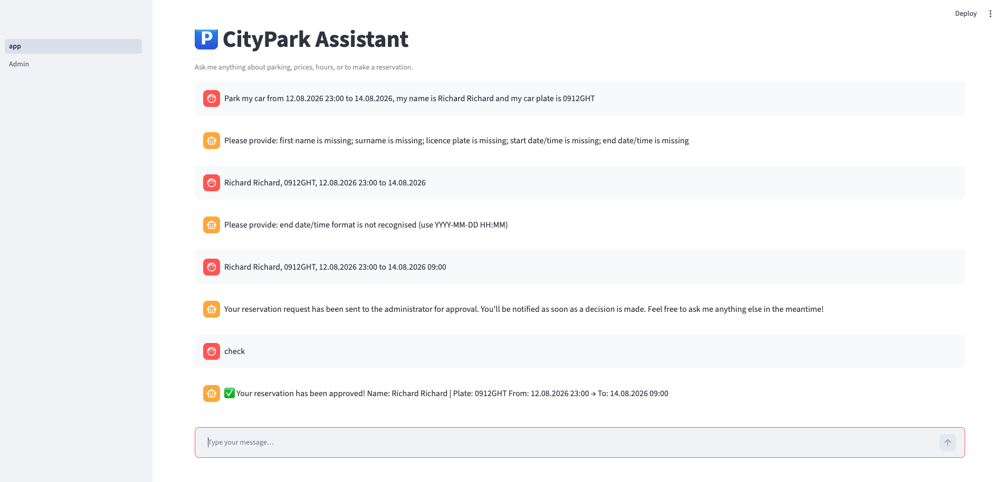
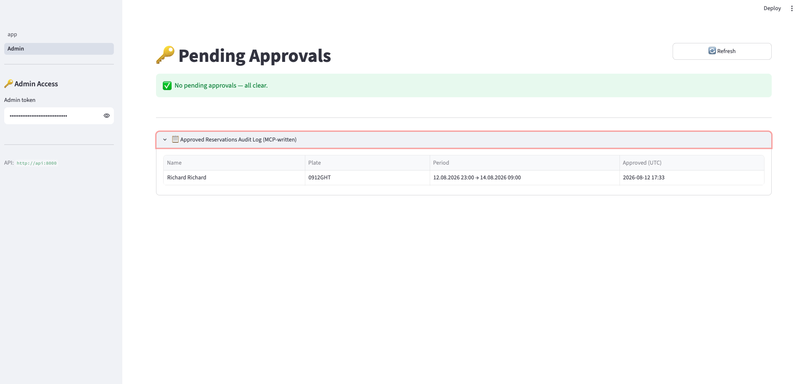
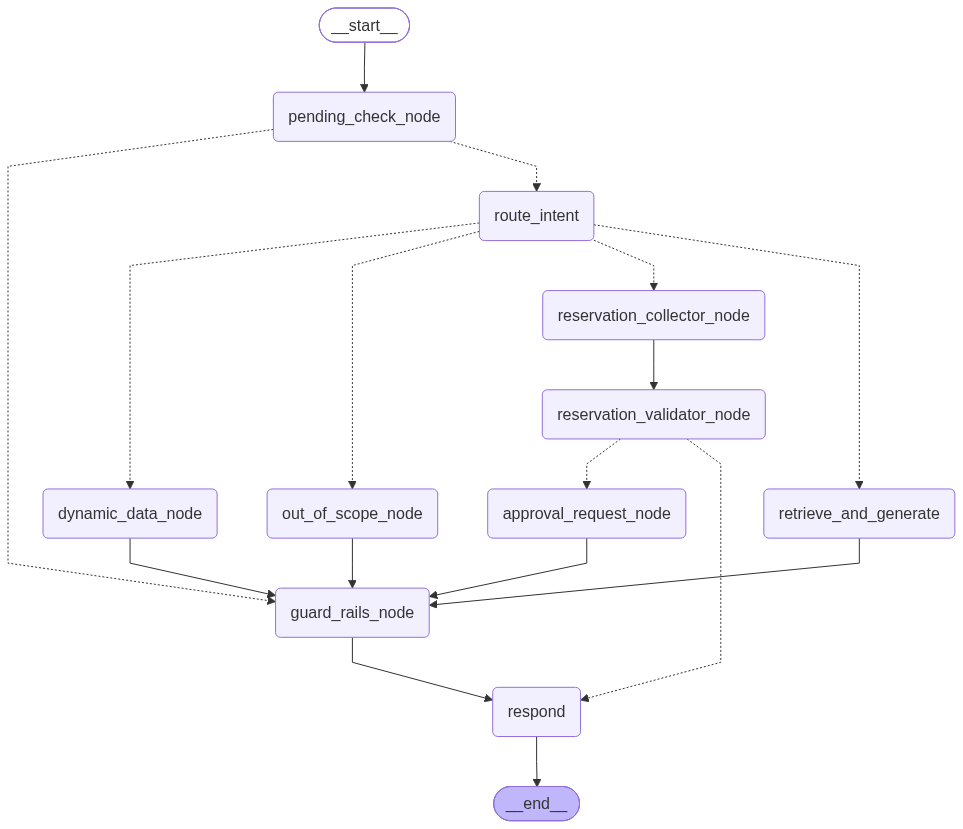

<style>
:root {
  --navy:  #0D2C54;
  --teal:  #007A87;
  --amber: #E5830A;
  --green: #2E7D32;
  --red:   #B71C1C;
  --bg:    #EFF3F8;
  --card:  #FFFFFF;
  --text:  #1A2540;
  --mid:   #8097B0;
  --border:#DDE5F0;
}

section {
  background: var(--bg);
  font-family: 'Inter', 'Segoe UI', 'Helvetica Neue', Arial, sans-serif;
  color: var(--text);
  padding: 1.8rem 2.5rem 2.5rem;
  font-size: 18px;
}

section::after { color: var(--mid); font-size: 0.75em; }

h1 {
  color: var(--navy);
  font-size: 1.75em;
  border-bottom: 3px solid var(--teal);
  padding-bottom: 0.2em;
  margin-bottom: 0.5em;
}

h2 { color: var(--navy); font-size: 1.25em; margin: 0.4em 0 0.2em; }

h3 { color: var(--teal); font-size: 1.05em; margin: 0.35em 0 0.2em; }

strong { color: var(--navy); }

a { color: var(--teal); }

ul { padding-left: 1.4em; }
li { margin: 0.18em 0; font-size: 0.9em; }

table { font-size: 0.82em; border-collapse: collapse; width: 100%; }
th { background: var(--navy); color: white; padding: 0.4em 0.7em; text-align: left; }
td { padding: 0.35em 0.7em; border-bottom: 1px solid var(--border); }
tr:nth-child(even) td { background: rgba(13,44,84,0.04); }

code {
  background: #E4EBF5;
  color: var(--text);
  padding: 0.1em 0.35em;
  border-radius: 3px;
  font-family: 'JetBrains Mono', 'Fira Code', 'Cascadia Code', 'Consolas', monospace;
  font-size: 0.88em;
}

pre {
  background: #141C2B !important;
  border-radius: 6px;
  padding: 0.8em 1em !important;
  overflow-x: auto;
}

pre code {
  background: transparent;
  color: #ABB2BF !important;
  font-size: 0.78em;
  padding: 0;
}

/* ── Title slide ─────────────────────────────────────────────────── */
section.title {
  background: var(--navy) !important;
  color: white !important;
  text-align: center;
  justify-content: center;
  align-items: center;
  display: flex;
  flex-direction: column;
}
section.title::after { color: rgba(255,255,255,0.3); }
section.title h1 {
  color: white;
  font-size: 2.1em;
  border-bottom-color: var(--teal);
}
section.title h2 { color: #80A8C8; font-weight: 400; border: none; }
section.title p  { color: #6090B0; font-size: 0.9em; }
section.title strong { color: #C0D8F0; }

/* ── Header-band slides ──────────────────────────────────────────── */
section.band h1 {
  background: var(--navy);
  color: white;
  margin: -1.8rem -2.5rem 0.8rem;
  padding: 0.65rem 2.5rem;
  font-size: 1.45em;
  border: none;
}

/* ── HITL accent ─────────────────────────────────────────────────── */
section.hitl { border-top: 5px solid var(--amber); }

/* ── MCP accent ──────────────────────────────────────────────────── */
section.mcp { border-top: 5px solid var(--green); }

/* ── Two / Three column helpers ──────────────────────────────────── */
.cols   { display: grid; grid-template-columns: 1fr 1fr;       gap: 1.2rem; }
.cols-3 { display: grid; grid-template-columns: 1fr 1fr 1fr;   gap: 0.9rem; }
.cols-4 { display: grid; grid-template-columns: repeat(4,1fr); gap: 0.8rem; }

/* ── Cards ───────────────────────────────────────────────────────── */
.card {
  background: var(--card);
  border-radius: 6px;
  padding: 0.75rem 1rem;
  border-left: 4px solid var(--teal);
}
.card.amber { border-left-color: var(--amber); }
.card.green { border-left-color: var(--green); }
.card.red   { border-left-color: var(--red);   }
.card.navy  { border-left-color: var(--navy);  }
.card.dark  { border-left-color: #2D3142;       }
.card h3    { margin-top: 0; }

/* ── Highlight bars ──────────────────────────────────────────────── */
.bar {
  padding: 0.45em 0.85em;
  border-radius: 4px;
  font-size: 0.88em;
  margin: 0.3em 0;
}
.bar.green { background: #E8F5E9; color: var(--green); }
.bar.red   { background: #FFEBEE; color: var(--red);   }
.bar.teal  { background: #E0F7FA; color: var(--teal);  }
.bar.amber { background: #FFF8E1; color: var(--amber); }
.bar.navy  { background: #E8EEF8; color: var(--navy);  }

/* ── Inline chips ────────────────────────────────────────────────── */
.chip {
  display: inline-block;
  padding: 0.1em 0.55em;
  border-radius: 10px;
  font-size: 0.75em;
  font-weight: 700;
  color: white;
  vertical-align: middle;
}
.chip.navy  { background: var(--navy);  }
.chip.teal  { background: var(--teal);  }
.chip.amber { background: var(--amber); }
.chip.green { background: var(--green); }
.chip.red   { background: var(--red);   }
.chip.dark  { background: #2D3142;       }

/* ── Flow rows ───────────────────────────────────────────────────── */
.flow {
  display: flex;
  align-items: center;
  gap: 0.3rem;
  flex-wrap: wrap;
  margin: 0.4rem 0;
}
.fbox {
  padding: 0.25em 0.6em;
  border-radius: 4px;
  font-size: 0.78em;
  font-weight: 600;
  color: white;
  white-space: nowrap;
}
.fbox.navy  { background: var(--navy);  }
.fbox.teal  { background: var(--teal);  }
.fbox.amber { background: var(--amber); }
.fbox.green { background: var(--green); }
.fbox.red   { background: var(--red);   }
.fbox.dark  { background: #2D3142;       }
.arr { color: var(--mid); font-size: 1.1em; }

/* ── Note / footer line ──────────────────────────────────────────── */
.note {
  font-size: 0.76em;
  color: var(--mid);
  border-top: 1px solid var(--border);
  padding-top: 0.35em;
  margin-top: 0.5em;
}
</style>


<!-- ══════════════════════════════════════════════════════════════════
     SLIDE 1 — Title
     ══════════════════════════════════════════════════════════════════ -->
<!-- _class: title -->

# 🅿 CityPark Intelligent Parking Chatbot

## Stages 1–4 · RAG Foundation · Reservation · HITL Approval · MCP Storage · Orchestration Hardening

---

**Overview · Architecture · RAG · Guard Rails · Reservation · HITL · MCP Storage · Orchestration · Evaluation**

Python 3.13 · LangChain · LangGraph · Milvus · PostgreSQL · FastAPI · Streamlit · MCP

*2026-08-12*

---

<!-- ══════════════════════════════════════════════════════════════════
     SLIDE 2 — Solution Overview
     ══════════════════════════════════════════════════════════════════ -->

# Solution Overview

<div class="cols">
<div class="card red">

### ❌ Problem
- Customers ring facility for basic info
- Staff answer repetitive questions
- Reservation process is manual and error-prone
- No 24/7 self-service channel
- No persistent audit trail of approvals

</div>
<div class="card green">

### ✅ Solution
- LLM-powered chatbot with RAG knowledge base
- Static Q&A: location, rules, booking info
- Dynamic: live prices, hours, availability (PostgreSQL)
- Multi-turn reservation collection via LangGraph
- Two-layer guard-rails: blocklist + Presidio PII
- **Stage 2**: Admin Human-in-the-Loop approval flow
- **Stage 3**: MCP server writes approved reservations to audit file
- **Stage 4**: Orchestration Hardening with LangGraph

</div>
</div>

| Story | Name | Priority |
|-------|------|----------|
| US1 | Ask a Parking Question | P1 MVP |
| US2 | Get Prices / Hours / Availability | P1 MVP |
| US3 | Make a Reservation | P2 |
| US4 | Guard Rails & Safety | P1 MVP |
| US5 | Approved Reservation Audit Log | P1 |

<div class="note">Delivery: 5 user stories · 98 unit tests · CI on GitHub Actions · Docker Compose full-stack</div>

---

<!-- ══════════════════════════════════════════════════════════════════
     SLIDE 3 — System Architecture
     ══════════════════════════════════════════════════════════════════ -->

# System Architecture

<div class="cols">
<div>

**User Layer**
```
Browser
  └── Streamlit UI :8501
        ├── Chat page (main)
        └── Admin page /Admin  ← Stage 3
```

**API Layer**
```
FastAPI :8000
  ├── POST /chat
  ├── GET  /admin/reservations/pending
  ├── POST /admin/reservation/{id}/approve  ← Stage 4
  ├── POST /admin/reservation/{id}/reject
  └── POST /admin/reload-knowledge
```

</div>
<div>

**Processing Layer**
```
LangGraph Workflow
  pending_check_node   ← Stage 3 (first)
  route_intent
  retrieve_and_generate
  dynamic_data_node
  reservation_collector_node
  reservation_validator_node
  approval_request_node  ← Stage 3
  guard_rails_node
  respond
```

**External Services**
```
OpenAI   GPT-4o + text-embedding-3-small
Milvus   Vector DB :19530  (IVF_FLAT)
PostgreSQL   Relational :5432
Presidio     PII scanning (spaCy)
Mailpit      SMTP dev server :1025/:8025  ← Stage 3
MCP Server   chatbot.storage.server (subprocess)  ← Stage 4
```

</div>
</div>

<div class="note">Docker Compose: etcd · minio · milvus · postgres · api · ui · mailpit — all health-checked · MCP server spawned per approval, not a persistent service</div>

---

<!-- ══════════════════════════════════════════════════════════════════
     SLIDE 4 — RAG Pipeline
     ══════════════════════════════════════════════════════════════════ -->

# RAG Pipeline — 8 Stages

| # | Stage | Detail | Phase |
|---|-------|--------|-------|
| 1 | **Ingest** | `DirectoryLoader` — 4 Markdown knowledge files | Offline |
| 2 | **Chunk** | `RecursiveCharacterTextSplitter` — 512 tokens, 50 overlap | Offline |
| 3 | **Embed** | `text-embedding-3-small` — 1536-dim vectors | Offline |
| 4 | **Store** | Milvus IVF_FLAT index — cosine similarity | Offline |
| 5 | **Retrieve** | Top-k = 5 by cosine similarity | Online |
| 6 | **Context** | Concatenate chunk content into prompt | Online |
| 7 | **Generate** | GPT-4o with grounded system prompt | Online |
| 8 | **Filter** | RuleBlocklist + Presidio PII scanner | Online |

```python
# ingest.py — offline, runs once at container startup
docs   = DirectoryLoader(data_dir, glob="**/*.md").load()
chunks = splitter.split_documents(docs)          # 15 chunks from 4 files
embeds = embedder.embed_documents([c.page_content for c in chunks])
store.add_documents(chunks, embeds)              # → Milvus IVF_FLAT index
```

<div class="note">15 chunks from 4 KB files (general · location · rules · booking) · ingest.py is fully idempotent (drop + recreate)</div>

---

<!-- ══════════════════════════════════════════════════════════════════
     SLIDE 5 — LangGraph Workflow
     ══════════════════════════════════════════════════════════════════ -->

# LangGraph Stateful Workflow

**Graph entry — Stage 2 adds `pending_check_node` as the first node:**

<div class="flow">
  <span class="fbox dark">START</span><span class="arr">→</span>
  <span class="fbox amber">pending_check_node</span><span class="arr">→</span>
  <span class="fbox teal">route_intent</span><span class="arr">→</span>
  <span class="fbox navy">retrieve_and_generate</span><span class="arr">→</span>
  <span class="fbox green">guard_rails_node</span><span class="arr">→</span>
  <span class="fbox dark">respond → END</span>
</div>

If decision/expired detected by `pending_check_node` → skips `route_intent`, goes straight to `guard_rails_node → respond`.

**Routing branches from `route_intent`:**

| Intent | Node | Color |
|--------|------|-------|
| `info_query` | `retrieve_and_generate` | navy |
| `pricing` / `hours` / `availability` | `dynamic_data_node` | teal |
| `reservation` | `reservation_collector → reservation_validator → approval_request_node` | amber |
| `out_of_scope` | `out_of_scope_node` | dark |

**`ConversationState` fields:**
`session_id` · `messages` (add_messages reducer) · `intent` · `retrieved_chunks` · `reservation: ReservationData | None` · `approval_request_id: str | None` · `response_draft` · `response_final` · `error`

---

<!-- ══════════════════════════════════════════════════════════════════
     SLIDE 6 — Guard Rails
     ══════════════════════════════════════════════════════════════════ -->

# Guard-Rails Mechanism

<div class="cols">
<div class="card red">

### Layer 1 — RuleBlocklist (regex)
- `sk-[A-Za-z0-9]{20,}` — API keys
- `eyJ[A-Za-z0-9_-]+\.[A-Za-z0-9_-]+` — JWT tokens
- `"ignore previous"`, `"disregard instructions"` — prompt injection probes
- Any match → response replaced with privacy disclaimer
- Zero external dependencies — pure Python `re`

</div>
<div class="card amber">

### Layer 2 — Presidio PII Scanner
- Entities: `PERSON`, `LOCATION`, `PHONE_NUMBER`, `EMAIL_ADDRESS`
- Entities: `CREDIT_CARD`, `IBAN_CODE`, `IP_ADDRESS`
- Custom regex: licence plates `/[A-Z]{2,3}[-\s]?\d{2,4}…/`
- Powered by Microsoft Presidio + spaCy `en_core_web_lg`
- Gracefully disabled if Presidio unavailable (logs warning)

</div>
</div>

<div class="bar amber">

⚡ **PII bypass** — approval/rejection notifications legitimately echo the user's own name and plate.
`guard_rails_node` skips PII scan when **`state.approval_request_id is not None`** OR `state.reservation.status ∈ {pending_approval, approved, rejected, expired}`.
Without this, Presidio detects `PERSON` in the approval message and replaces it with the privacy disclaimer.

</div>

**Flow:** `response_draft` → `RuleBlocklist.check()` → `PiiScanner.scan()` → match? → `"privacy disclaimer"` | pass → `response_final`

---

<!-- ══════════════════════════════════════════════════════════════════
     SLIDE 7 — Reservation Workflow
     ══════════════════════════════════════════════════════════════════ -->

# Reservation Workflow (US3)

<div class="flow">
  <span class="fbox navy">User message</span><span class="arr">→</span>
  <span class="fbox teal">reservation_collector_node</span><span class="arr">→</span>
  <span class="fbox teal">reservation_validator_node</span><span class="arr">→</span>
  <span class="fbox amber">approval_request_node</span><span class="arr">→</span>
  <span class="fbox green">guard_rails → respond</span>
</div>

- ❌ Missing / invalid fields → ask for next field (loop back)
- ✅ All fields valid → `status = "submitted"` → `approval_request_node` → `status = "pending_approval"`

<div class="cols">
<div>

**Required fields & validation**

| Field | Rule |
|-------|------|
| `first_name` | presence |
| `surname` | presence |
| `license_plate` | `^[A-Z0-9]{2,10}$` |
| `start_datetime` | DD.MM.YYYY HH:MM or YYYY-MM-DD HH:MM |
| `end_datetime` | same format + end > start |

</div>
<div>

**LLM JSON extraction (GPT-4o)**

```python
# Extracts fields from free-form user text
{
  "first_name":   "Aleksandr",
  "surname":      "Mordanov",
  "license_plate":"1672MNP",
  "start_datetime":"12.08.2026 12:00",
  "end_datetime":  "13.08.2026 12:00"
}
# Code-fence stripping + setattr() merge
# into existing ReservationData
```

</div>
</div>

---

<!-- ══════════════════════════════════════════════════════════════════
     SLIDE 8 — Evaluation
     ══════════════════════════════════════════════════════════════════ -->

# Evaluation Framework

<div class="cols">
<div>

**Metrics**

```python
Recall@5    = |relevant ∩ top5| / |relevant|
Precision@5 = |relevant ∩ top5| / 5

EvaluationReport
  .mean_recall     # avg Recall@5
  .mean_precision  # avg Precision@5
  .pass_rate       # fraction with recall == 1.0
```

**Run**
```bash
python scripts/evaluate.py
# → eval/reports/YYYY-MM-DDTHH-MM-SS.json
```

</div>
<div>

**Evaluation Dataset** — 22 Q&A pairs

| Category | Questions | Focus |
|----------|-----------|-------|
| `info_query` | 6 | Location, facilities, rules |
| `pricing` | 5 | Hourly / daily / monthly rates |
| `hours` | 5 | Opening times by day |
| `availability` | 6 | Free spaces, capacity |

Dataset: `eval/questions.json`
Note: `relevant_chunk_ids` require back-fill after ingest for Recall/Precision to reflect real retrieval quality.

</div>
</div>

---

<!-- ══════════════════════════════════════════════════════════════════
     SLIDE 9 — Live Demo
     ══════════════════════════════════════════════════════════════════ -->

# Live Demo — Streamlit UI

`http://localhost:8501` · Admin panel: `http://localhost:8501/Admin`

<div class="cols">
<div>

**Verified sample interactions**

👤 `What are the parking rates?`
🤖 Hourly: 2.50 EUR · Daily: 15.00 EUR · Monthly: 120.00 EUR · Overnight: 8.00 EUR

👤 `What time do you open on Sunday?`
🤖 Sunday hours: 08:00 – 20:00

👤 `First name: Aleksandr, Surname: Mordanov, Plate: 1672MNP, Start: 12.08.2026 12:00, End: 13.08.2026 12:00`
🤖 Your reservation request has been sent to the administrator for approval. You'll be notified as soon as a decision is made.

👤 `(next message after admin approves)`
🤖 ✅ Your reservation has been approved! Name: Aleksandr Mordanov | Plate: 1672MNP · From: 12.08.2026 12:00 → 13.08.2026 12:00

</div>
<div>

**UI features**
- Session UUID preserved in `st.session_state`
- Spinner during API call
- Error banner on API failure
- Full message history rendered
- `st.chat_message` for native chat bubbles

**Admin page features (Stage 2)**
- Password field for admin token (sidebar)
- Cards: name · plate · dates · request ID
- Reason text field + Approve / Reject buttons
- `st.toast()` on success + auto-refresh
- `st.rerun()` after decision

</div>
</div>

---

<!-- ══════════════════════════════════════════════════════════════════
     SLIDE 10 — Key Technical Decisions
     ══════════════════════════════════════════════════════════════════ -->

# Key Technical Decisions

<div class="cols-3">
<div class="card teal">

### Lazy pymilvus imports
Import inside method body, not at module level.
**→** All 98 unit tests run without Milvus installed — CI stays fast.

</div>
<div class="card navy">

### VectorStorePort ABC
`MilvusVectorStore` implements a minimal ABC (`add_documents`, `similarity_search`, `drop_collection`).
**→** Swapping to Pinecone is a single-file change.

</div>
<div class="card amber">

### Pydantic Settings singleton
Module-level `settings` reads all config from `.env` at import time.
**→** Wrong config fails loudly at startup, not mid-request.

</div>
<div class="card green">

### MCP stdio transport
`ReservationStorageClient` spawns `python -m chatbot.storage.server` as a child process per write call. Communication is stdin/stdout — zero network exposure.
**→** No new Docker service; process isolation is the security boundary.

</div>
<div class="card red">

### Guard-rails as a graph node
`guard_rails_node` is an explicit node all generation paths route through.
**→** New generation nodes are automatically filtered without touching guard-rails code.

</div>
<div class="card dark">

### Zero new infrastructure deps
`PendingStore` — module-level dicts, no Redis/DB for HITL.
`ReservationWriter` — stdlib `fcntl` for file locking, no message queue.
**→** Two features added, zero new services.

</div>
</div>

---

<!-- ══════════════════════════════════════════════════════════════════
     SLIDE 11 — Tests & CI
     ══════════════════════════════════════════════════════════════════ -->

# Tests & CI

<div class="cols">
<div>

| Module | Tests | What it covers |
|--------|-------|----------------|
| `test_workflow_nodes.py` | 21 | All 9 graph nodes: RAG, dynamic data, out-of-scope, collector, approval, guard rails, pending check, respond |
| `test_workflow_graph.py` | 8 | All 3 routing functions — intent, validator, pending-check — every branch |
| `test_pipeline_integration.py` | 2 | Full submit → approve/reject → user notification path (mocked, no Docker) |
| `test_approval_api.py` | 7 | 204 / 401 / 404 / 409 + storage call behavior |
| `test_approval_nodes.py` | 6 | approved / rejected / expired pending-check outcomes |
| `test_storage_writer.py` + `test_storage_server.py` + `test_storage_client.py` | 12 | MCP file write, tool handler, stdio client, error propagation |
| `test_rag_pipeline.py` + `test_retriever.py` | 9 | Retrieval and answer generation |
| `test_guard_rails.py` + `test_validator.py` + others | 33 | PII/blocklist, reservation validation, config, evaluation, approval models/store/service/notifier |

<div class="bar green">✅ pytest tests/unit/ → **98 passed** (all external services mocked, < 2 s)</div>

</div>
<div>

**GitHub Actions CI**

```yaml
on: push (main) · pull_request

jobs:
  lint:
    ruff check src/ tests/
    ruff format --check

  test:
    python-version: '3.13'
    pip install -r requirements-dev.txt -e .
    python -m spacy download en_core_web_lg  ← Stage 4 fix
    pytest tests/unit/ -v --tb=short

# Integration: local-only (Docker required)
```

- `pythonpath = ["src"]` in `pyproject.toml`
- Graph routing tests: pure Python — no LLM, no mocks needed
- Pipeline tests: `httpx.AsyncClient` over FastAPI `app`, full LangGraph execution
- Storage tests: tool function called directly (no subprocess)
- Client tests: `stdio_client` + `ClientSession` mocked via `unittest.mock`

</div>
</div>

---

<!-- ══════════════════════════════════════════════════════════════════
     SLIDE 12 — Stage 3 HITL Architecture
     ══════════════════════════════════════════════════════════════════ -->
<!-- _class: hitl -->

# Stage 2 — Human-in-the-Loop Approval

<div class="cols">
<div>

**Approval request flow**

<div class="flow">
  <span class="fbox teal">reservation_validator</span><span class="arr">→</span>
  <span class="fbox amber">approval_request_node</span><span class="arr">→</span>
  <span class="fbox dark">SMTP email</span>
</div>

- Creates `ApprovalRequest` (UUID) in `PendingStore`
- Sends email via `smtplib` (stdlib, sync)
- Mailpit SMTP `:1025` · Web UI `:8025`
- Subject: `[Parking Reservation] New request from {name} — {id}`
- Body contains: name, plate, dates, two `curl` approve/reject commands
- Bot replies: *"Your request is awaiting admin approval"*

**Admin decision flow**

```bash
# Approve
curl -X POST http://localhost:8000/admin/reservation/{id}/approve \
     -H "Authorization: Bearer <ADMIN_TOKEN>"

# Reject with reason
curl -X POST http://localhost:8000/admin/reservation/{id}/reject \
     -H "Authorization: Bearer <ADMIN_TOKEN>" \
     -d '{"reason": "No spaces available"}'
```

Or use the Streamlit Admin page at `http://localhost:8501/Admin`

</div>
<div>

**User notification flow**

<div class="flow">
  <span class="fbox dark">START</span><span class="arr">→</span>
  <span class="fbox amber">pending_check_node</span>
</div>
<div class="flow">
  <span class="arr">→ decision/expired →</span>
  <span class="fbox green">guard_rails → respond</span>
</div>
<div class="flow">
  <span class="arr">→ no decision →</span>
  <span class="fbox teal">route_intent (normal flow)</span>
</div>

**Status lifecycle**

<div class="flow">
  <span class="fbox dark">draft</span><span class="arr">→</span>
  <span class="fbox teal">submitted</span><span class="arr">→</span>
  <span class="fbox amber">pending_approval</span><span class="arr">→</span>
  <span class="fbox green">approved</span>
</div>
<div class="flow">
  <span class="arr">or →</span>
  <span class="fbox red">rejected / expired</span>
</div>

**`PendingStore`** — module-level dicts:
`_by_session: dict[str, str]` and `_by_request: dict[str, ApprovalRequest]`
Lazy timeout check per user message · zero new infrastructure dependencies

</div>
</div>

---

<!-- ══════════════════════════════════════════════════════════════════
     SLIDE 13 — Stage 3 Demo Walkthrough
     ══════════════════════════════════════════════════════════════════ -->
<!-- _class: hitl -->

# Stage 2 — End-to-End Walkthrough

<div class="cols-4">
<div class="card teal">

### 1 · Submit
User provides all reservation fields in chat.

`approval_request_node` creates `ApprovalRequest` (UUID).

SMTP email sent via `smtplib` → Mailpit.

Bot replies: *"Your request is awaiting approval."*

</div>
<div class="card navy">

### 2 · Admin email
Subject: `[Parking Reservation] New request from {name} — {id}`

Body: name · plate · dates.

Two `curl` commands: approve or reject.

Mailpit web UI: `http://localhost:8025`

**Or:** Streamlit Admin page → card with Approve / Reject buttons + reason field.

</div>
<div class="card amber">

### 3 · Admin decides
```bash
POST /admin/reservation/{id}/approve
  → 204 No Content

POST /admin/reservation/{id}/reject
  -d '{"reason":"…"}'
  → 204 No Content
```

409 if already decided.
401 if wrong token.

Decision stored in `PendingStore` in-process.

</div>
<div class="card green">

### 4 · User notified
User sends **any next message**.

`pending_check_node` detects decision.

**Approved:**
✅ *Your reservation has been approved!*

**Rejected:**
❌ *Your reservation was not approved.*
*Reason: {reason}*

**Expired:**
⏰ *Request timed out. Please resubmit.*

Store entry cleared after delivery.

</div>
</div>

<div class="note">23 approval unit tests across 6 modules · pending_check_node sets approval_request_id to bypass PII scan for notification messages · Full walkthrough: specs/002-admin-approval/quickstart.md</div>

---

<!-- ══════════════════════════════════════════════════════════════════
     SLIDE 14 — Stage 3 MCP Architecture
     ══════════════════════════════════════════════════════════════════ -->
<!-- _class: mcp -->

# Stage 3 — MCP Reservation Storage

<div class="cols">
<div>

**Storage package** `src/chatbot/storage/`

<div class="flow">
  <span class="fbox amber">approve endpoint</span><span class="arr">→</span>
  <span class="fbox teal">client.py</span><span class="arr">→</span>
  <span class="fbox green">subprocess</span><span class="arr">→</span>
  <span class="fbox dark">server.py</span><span class="arr">→</span>
  <span class="fbox navy">writer.py</span><span class="arr">→</span>
  <span class="fbox green">📄 file</span>
</div>

| Module | Role |
|--------|------|
| `writer.py` | `ReservationWriter` — `fcntl.LOCK_EX`, pipe sanitization, `ValueError` on empty fields |
| `server.py` | `MCPServer` + `@server.tool()` — reads `RESERVATIONS_FILE_PATH` from env, delegates to writer |
| `client.py` | `ReservationStorageClient` — `StdioServerParameters` + `ClientSession`, raises `RuntimeError` on `is_error` |

**Storage format**

```
Alice Smith | ABC123 | 2026-08-15 10:00 → 2026-08-16 10:00 | 2026-08-12 14:30
```

`Name | Car Number | Reservation Period | Approval Time (UTC)`

</div>
<div>

**Design decisions**

<div class="card green">

### Non-fatal writes
Approval recorded in `PendingStore` *before* MCP call. Write failure is logged; approval is **never rolled back** — the user still receives their chat notification.

</div>

<div class="card navy">

### Process isolation
MCP server is a child process communicating via stdin/stdout only. No network port, no auth token required — the API layer's admin token is the security boundary.

</div>

<div class="card teal">

### Per-call subprocess
Fresh process per approval. Acceptable at ~1–10 approvals/day. Eliminates zombie processes; subprocess startup ~200 ms.

</div>

<div class="bar green">

`RESERVATIONS_FILE_PATH` env var (default: `data/reservations.txt`) · parent directories created on first write · file excluded from git

</div>

</div>
</div>

---

<!-- ══════════════════════════════════════════════════════════════════
     SLIDE 15 — Stage 3 MCP Demo
     ══════════════════════════════════════════════════════════════════ -->
<!-- _class: mcp -->

# Stage 3 — End-to-End Walkthrough

<div class="cols-4">
<div class="card amber">

### 1 · Approve
```bash
curl -s -X POST \
  http://localhost:8000/admin/\
reservation/{id}/approve \
  -H "Authorization: \
Bearer change-me"
```

Returns HTTP 204.

`ApprovalService.record_decision()` stores the decision in `PendingStore`.

</div>
<div class="card teal">

### 2 · MCP call
`approve_reservation` endpoint calls:

```python
await ReservationStorageClient()\
  .write_record(
    name="Alice Smith",
    car_number="ABC123",
    reservation_period=
      "2026-08-15 10:00 →
       2026-08-16 10:00",
    approval_time="2026-08-12 14:30",
  )
```

Client spawns `python -m chatbot.storage.server` subprocess.

</div>
<div class="card navy">

### 3 · Subprocess writes
MCP server receives `tools/call` request.

Calls `ReservationWriter.write()`.

Acquires `fcntl.LOCK_EX` on file.

Appends line, flushes, releases lock.

Returns `"ok: Alice Smith | ABC123 | …"` to client.

Subprocess exits cleanly.

</div>
<div class="card green">

### 4 · Verify
```bash
docker compose exec api \
  cat data/reservations.txt
```

Expected:
```
Alice Smith | ABC123 |
2026-08-15 10:00 →
2026-08-16 10:00 |
2026-08-12 14:30
```

If missing — check logs:
```bash
docker compose logs api \
  | grep -i "storage\|error"
```

</div>
</div>

<div class="note">Prerequisite: package installed in container (`pip install -e .` in Dockerfile) so subprocess can import `chatbot` · 12 MCP unit tests (writer · server · client) · Full walkthrough: specs/003-mcp-reservation-storage/quickstart.md</div>

---

<!-- ══════════════════════════════════════════════════════════════════
     SLIDE 16 — Stage 4 Orchestration Hardening
     ══════════════════════════════════════════════════════════════════ -->
<!-- _class: band -->

# Stage 4 — Orchestration Hardening

<div class="cols">
<div>

**What was added**

| File | Change | Tests |
|------|--------|-------|
| `test_workflow_graph.py` | New — 3 routing functions, all branches | 8 |
| `test_workflow_nodes.py` | Expanded — all 9 nodes now covered | +17 |
| `test_pipeline_integration.py` | New — full approve + reject paths | 2 |
| `.github/workflows/ci.yml` | Added `python -m spacy download en_core_web_lg` | — |
| `README.md` | Evaluation results section with run instructions | — |

<div class="bar green">**+29 tests** · 69 → 98 passing · no new `src/` modules</div>

</div>
<div>

**Why graph routing tests matter**

`workflow/graph.py` had **zero tests** before this PR. The three routing functions are the wiring connecting all nodes — a wrong branch condition silently misroutes messages.

<div class="card navy">

### `_route_after_intent`
`info_query` → `retrieve_and_generate` · `pricing/hours/availability` → `dynamic_data_node` · `reservation` → `reservation_collector_node` · `out_of_scope` → `out_of_scope_node`

</div>

<div class="card amber">

### `_route_after_reservation_validator`
`submitted` → `approval_request_node` · any other status → `respond`

</div>

<div class="card teal">

### `_route_after_pending_check`
decision/expired in state → `guard_rails_node` · no pending → `route_intent`

</div>

</div>
</div>

<div class="note">Pipeline integration tests exercise real LangGraph execution — POST /chat → approve → POST /chat — with all external services mocked · specs/004-langgraph-orchestration/quickstart.md</div>

---

<!-- ══════════════════════════════════════════════════════════════════
     SLIDE 17 — Demo: Main Chat Screen
     ══════════════════════════════════════════════════════════════════ -->
<!-- _class: band -->

# Demo — CityPark Assistant Chat



**Multi-turn reservation flow**

- User submits partial info → bot requests missing fields
- Date format rejected → bot explains expected format
- All fields valid → `approval_request_node` fires
- Next message after admin approves → ✅ notification delivered

<div class="bar teal">LangGraph routes each turn through the correct node — field collection, validation, approval request, and notification are all separate graph nodes.</div>

---

<!-- ══════════════════════════════════════════════════════════════════
     SLIDE 18 — Demo: Admin Page & MCP Audit Log
     ══════════════════════════════════════════════════════════════════ -->
<!-- _class: band -->

# Demo — Admin Page · MCP Audit Log



**Stage 3 (HITL) + Stage 4 (MCP) visible in one view**

- `GET /admin/reservations/log` reads `data/reservations.txt`
- File was written by the MCP subprocess on approval
- Table parsed from pipe-delimited format: `Name | Plate | Period | Approved (UTC)`
- Expander renders even when no pending approvals remain

<div class="bar green">Richard Richard · 0912GHT · 12.08.2026 23:00 → 14.08.2026 09:00 · approved 2026-08-12 17:33 UTC</div>

---

<!-- ══════════════════════════════════════════════════════════════════
     SLIDE 19 — LangGraph Orchestration Diagram
     ══════════════════════════════════════════════════════════════════ -->
<!-- _class: band -->

# Stage 4 — LangGraph Orchestration Graph



**Generated from running code**

```python
compiled_graph.get_graph().draw_mermaid_png()
```

- **Solid arrows** — unconditional edges
- **Dashed arrows** — conditional routing
- Every message enters `pending_check_node` first
- All generation paths converge at `guard_rails_node`
- `respond` is the single exit point before `__end__`

<div class="bar navy">9 nodes · 3 routing functions · zero cycles — acyclic per-turn execution with full conversation state preserved in `ConversationState`</div>
